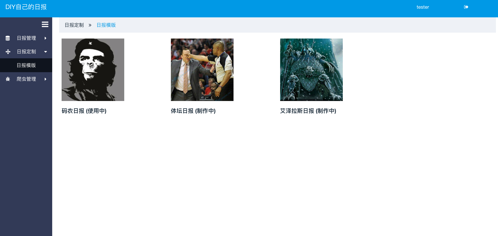

# DIY Daily

项目地址预览地址:

[项目阿里云地址](http://139.196.87.132:8090)

## 项目简介

项目大致分为前端、后端两大模块，前端模块使用angular4.x + primeng 开发；后端服务使用nodejs编写,爬虫使用python，数据库使用MySQL。

项目目前基于

* [Angular4](https://angular.cn/docs/ts/latest/quickstart.html) [Angular CLI]

* [Angular CLI](https://cli.angular.io/) [Angular CLI]

* [primeNg](https://www.primefaces.org/primeng/#/) [primeNg]

* [angular4-primeng-admin](https://github.com/hbb520/angular4-primeng-admin)

* [frontendDaily](https://github.com/kujian/frontendDaily)

* [大漠老师NiceFish](http://git.oschina.net/mumu-osc/NiceFish)

## Build

1. 因后端服务使用nodejs的koa2，所以安装 node > 7.0.0

2. 因前端使用angular-cli，需 npm install -g @angular/cli

3. python爬虫需使用包： pip install schedule， pip install beautifulsoup4， pip install MySQLdb（如果你不使用MySQL可以安装其他数据库的python的依赖包）

4. 在 Frontend 下执行: npm install  
   在 Backend／backendServer 下执行: npm install

5. 在 Frontend 下执行: ng serve ,如若操作无误浏览器打开 http://localhost:4200 ,将会显示部署的前端页面

## 效果图





## FileTree 目录结构
```shell
├── README.md
├── e2e
│   ├── app.e2e-spec.ts
│   ├── app.po.ts
│   └── tsconfig.e2e.json
├── karma.conf.js
├── package.json
├── protractor.conf.js
├── src
│   ├── app
│   │   ├── app.component.css
│   │   ├── app.component.html
│   │   ├── app.component.ts
│   │   ├── app.module.ts
│   │   ├── app.routes.ts
│   │   ├── collection
│   │   │   ├── collection.component.css
│   │   │   ├── collection.component.html
│   │   │   ├── collection.component.ts
│   │   │   └── collection.module.ts
│   │   ├── common
│   │   │   ├── http.service.ts
│   │   │   └── public-data.ts
│   │   ├── components
│   │   │   ├── my-breadcrumb
│   │   │   ├── my-carousel
│   │   │   ├── my-gotop
│   │   │   ├── my-information
│   │   │   ├── my-loading
│   │   │   ├── my-switch
│   │   │   └── my-tag
│   │   ├── data-table
│   │   │   ├── data-table.component.css
│   │   │   ├── data-table.component.html
│   │   │   ├── data-table.component.ts
│   │   │   └── data-table.module.ts
│   │   ├── editor
│   │   │   ├── editor.component.css
│   │   │   ├── editor.component.html
│   │   │   ├── editor.component.ts
│   │   │   └── editor.module.ts
│   │   ├── not-found.component.ts
│   │   ├── preloading.ts
│   │   ├── template
│   │   │   ├── template.component.css
│   │   │   ├── template.component.html
│   │   │   ├── template.component.ts
│   │   │   └── template.module.ts
│   │   └── workspace
│   │       ├── workspace.component.css
│   │       ├── workspace.component.html
│   │       ├── workspace.component.ts
│   │       ├── workspace.module.ts
│   │       ├── workspace.routes.ts
│   │       └── workspace.service.ts
│   ├── assets
│   │   ├── css
│   │   │   ├── font-awesome.css
│   │   │   ├── font-awesome.css.map
│   │   │   └── font-awesome.min.css
│   │   ├── data
│   │   │   └── user-menu.json
│   │   ├── fonts
│   │   │   ├── FontAwesome.otf
│   │   │   ├── fontawesome-webfont.eot
│   │   │   ├── fontawesome-webfont.svg
│   │   │   ├── fontawesome-webfont.ttf
│   │   │   ├── fontawesome-webfont.woff
│   │   │   └── fontawesome-webfont.woff2
│   │   ├── image
│   │   │   ├── baozou.png
│   │   │   ├── sport.jpg
│   │   │   ├── timg.jpeg
│   │   │   └── wow.jpg
│   │   └── monaco
│   │       └── vs -> ../../../node_modules/monaco-editor/min/vs
│   ├── environments
│   │   ├── environment.prod.ts
│   │   └── environment.ts
│   ├── favicon.ico
│   ├── index.html
│   ├── main.ts
│   ├── polyfills.ts
│   ├── styles.css
│   ├── test.ts
│   ├── theme-element.css
│   ├── tsconfig.app.json
│   ├── tsconfig.spec.json
│   └── typings.d.ts
├── tsconfig.json
└── tslint.json

```

## 关于

示例界面的码农日报内容由 https://github.com/kujian/frontendDaily 处爬取

大家若果感觉此项目有可用之处或看好本项目, 可以帮忙点个star, 我会继续努力完善   

我的QQ 845456707  

Your will, my hands.
